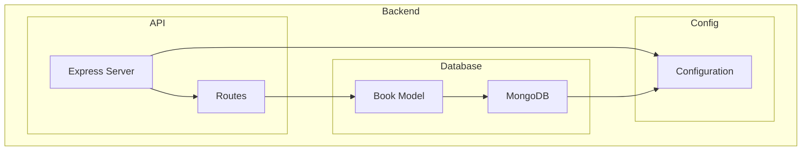

    

    <b>Automatic Architecture Diagrams from Code</b> 
    <a href="https://github.com/swark-io/swark">GitHub</a> • <a href="https://swark.io">Website</a> • <a href="mailto:contact@swark.io">Contact Us</a>

## Usage Instructions

1. **Render the Diagram**: Use the links below to open it in Mermaid Live Editor, or install the [Mermaid Support](https://marketplace.visualstudio.com/items?itemName=bierner.markdown-mermaid) extension.
2. **Recommended Model**: If available for you, use `claude-3.5-sonnet` [language model](vscode://settings/swark.languageModel). It can process more files and generates better diagrams.
3. **Iterate for Best Results**: Language models are non-deterministic. Generate the diagram multiple times and choose the best result.

## Generated Content
**Model**: GPT-4o - [Change Model](vscode://settings/swark.languageModel)  
**Mermaid Live Editor**: [View](https://mermaid.live/view#pako:eNqFkE1rwzAMhv-K0bn9AzkM4jiHHQql7c3eQY2VD5rYwR9jo_S_z4tX1ozCdNLzSnqRdIXGaoIClOkczj07CWVYCh_PWeDYXMjorK4q5f71V_2OUtYfsyPv2ZHcO7m3dZnLg42B_IP83FhgwDN6Wo9XcmdNZwX_Yyskt_bCdumO8V_rypp26NYGtcxqdBgGa555LElOS7bdvjCegS_w8zKxQPXYVmeo7gAbmMhNOOj08quC0NNECgqmQFOLcQwKbqkpzhoDiQHT1hMUwUXaAMZgj5-mubOzseuhaHH0dPsCr0OA8A) | [Edit](https://mermaid.live/edit#pako:eNqFkE1rwzAMhv-K0bn9AzkM4jiHHQql7c3eQY2VD5rYwR9jo_S_z4tX1ozCdNLzSnqRdIXGaoIClOkczj07CWVYCh_PWeDYXMjorK4q5f71V_2OUtYfsyPv2ZHcO7m3dZnLg42B_IP83FhgwDN6Wo9XcmdNZwX_Yyskt_bCdumO8V_rypp26NYGtcxqdBgGa555LElOS7bdvjCegS_w8zKxQPXYVmeo7gAbmMhNOOj08quC0NNECgqmQFOLcQwKbqkpzhoDiQHT1hMUwUXaAMZgj5-mubOzseuhaHH0dPsCr0OA8A)

